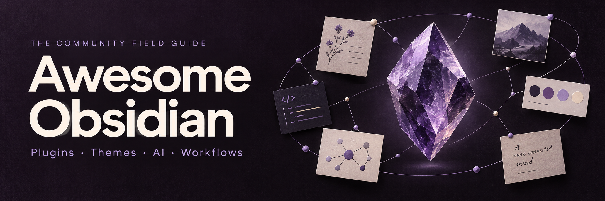

# Awesome Obsidian

A community guide to Obsidian resources, use cases and workflows. Read this catalog directly on GitHub or in a Markdown reader; the website adds search, filters and easier browsing.

[简体中文](README.zh-CN.md) · [Contributing](CONTRIBUTING.md)

<!-- catalog:start -->
232 entries · 15 illustrated themes · 7 workflow guides

## Start with a task

| I want to… | Start here |
| --- | --- |
| Start using Obsidian | [Obsidian Help](#resource-obsidian-help) · [kepano’s Obsidian vault](#resource-kepano-vault) |
| Collect reading notes | [Obsidian Web Clipper](#resource-web-clipper) · [From a saved article to a usable note](#resource-reading-workflow) |
| Research a topic | [From a question to a sourced answer](#resource-research-workflow) · [Zotero Integration](#resource-zotero-integration) · [Dataview](#resource-dataview) · [Dataview Example Vault](#resource-dataview-example-vault) |
| Plan projects | [From a project goal to next actions](#resource-projects-workflow) · [Tasks](#resource-tasks) · [Kanban](#resource-kanban) · [LifeOS](#resource-lifeos) |
| Write and find Chinese notes | [Easy Typing](#resource-easy-typing) · [Fuzzy Chinese Pinyin](#resource-fuzzy-chinese) · [PKMer](#resource-pkmer) |
| Use AI with your notes | [Use AI with a focused set of notes](#resource-ai-workflow) · [Local GPT](#resource-local-gpt) · [LLM Workspace](#resource-llm-workspace) · [Obsidian Skills](#resource-obsidian-skills) |
| Publish a knowledge garden | [Obsidian Publish](#resource-obsidian-publish) · [Quartz](#resource-quartz) · [Digital Garden](#resource-digital-garden) |
| Customize the look | [Minimal](#resource-minimal) · [Things](#resource-things) · [Modular CSS Layout](#resource-modular-css) |
| Finish a draft | [From linked notes to a finished draft](#resource-writing-workflow) |
| Learn and review | [From course notes to usable knowledge](#resource-learning-workflow) |
| Sync, back up and recover | [From device sync to recoverable backups](#resource-sync-backup-workflow) · [Sync your notes across devices](#resource-sync-methods-guide) · [Back up your Obsidian files](#resource-backup-guide) · [Obsidian Sync](#resource-obsidian-sync) · [Obsidian Git](#resource-obsidian-git) |

## Contents

- [Official & core](#category-official) · 22
- [Plugins](#category-plugins) · 75
- [Themes & appearance](#category-appearance) · 21
- [Templates & vaults](#category-templates) · 18
- [AI & automation](#category-ai) · 32
- [Tools & integrations](#category-integrations) · 22
- [Workflows](#category-workflows) · 7
- [Methods](#category-methods) · 10
- [Learning & community](#category-learning) · 12
- [Development](#category-development) · 13

## Official & core

[Start here](#topic-official-start) · [Core features & services](#topic-official-core) · [Links & discovery](#topic-official-linking) · [Writing & structure](#topic-official-writing) · [Workspace & app links](#topic-official-workspace)

### Start here

- [Obsidian](https://obsidian.md/) — Download Obsidian and explore its local Markdown notes, links and extensions.
- [Obsidian Help](https://obsidian.md/help/) — Look up setup instructions, core features and everyday operations in the official help.
- [Obsidian Community](https://community.obsidian.md/) — Browse the official directory of community plugins and themes.

### Core features & services

- [Bases](https://obsidian.md/help/bases) — Create database-style views of notes with property filters, sorting and formulas.
- [Canvas](https://obsidian.md/canvas) — Arrange notes, images and web pages on an infinite canvas for visual thinking.
- [Obsidian CLI](https://obsidian.md/cli) — Control Obsidian from the terminal to read, create and search notes in scripts.
- [Obsidian Sync](https://obsidian.md/sync) — Sync vaults across devices with the official service, selective syncing and version history. · Paid
  Useful when you want less sync configuration; file changes propagate, so keep a separate backup.
  Requires a subscription; storage and history retention depend on the plan.
- [Obsidian Publish](https://obsidian.md/publish) — Publish selected notes as an online knowledge base, wiki or digital garden. · Paid
  Useful for publishing selected notes directly; check whether their attachments and links are suitable for public access.

### Links & discovery

- [Backlinks](https://help.obsidian.md/Plugins/Backlinks) — Find notes that link to the current note and mentions that could become links.
- [Search](https://help.obsidian.md/Plugins/Search) — Combine text, path, tag and property searches to find notes.
- [Graph View](https://help.obsidian.md/Plugins/Graph+view) — Explore connections across the vault or around a single note.
- [Internal Links](https://help.obsidian.md/Linking+notes+and+files/Internal+links) — Link to notes, headings and blocks to connect ideas precisely.
- [Embed Files](https://help.obsidian.md/Linking+notes+and+files/Embed+files) — Show notes, images and other attachments inside a note.

### Writing & structure

- [Properties](https://help.obsidian.md/Editing+and+formatting/Properties) — Store status, dates, numbers and links as structured note data for consistent filtering.
  Useful for queryable project, book or source collections; a property name shares one type throughout a vault, so choose names consistently.
- [Templates](https://help.obsidian.md/Plugins/Templates) — Insert a reusable note structure into the current file, with title, date and time variables.
  A starting point for meeting, reading and review formats without adding a scripted template plugin.
- [Daily Notes](https://help.obsidian.md/Plugins/Daily+notes) — Create dated notes for daily logs, capture and reflection.
- [Note Composer](https://help.obsidian.md/Plugins/Note+composer) — Extract selected text into another note or merge notes together.
- [Callouts](https://help.obsidian.md/Editing+and+formatting/Callouts) — Use labeled blocks to distinguish examples, questions and summaries.
- [Markdown Syntax](https://help.obsidian.md/Editing+and+formatting/Basic+formatting+syntax) — Learn the headings, lists, tables and formatting supported in notes.

### Workspace & app links

- [Bookmarks](https://help.obsidian.md/Plugins/Bookmarks) — Keep frequently used notes, searches and headings within reach.
- [Workspaces](https://help.obsidian.md/Plugins/Workspaces) — Save and restore layouts for different kinds of work.
- [Obsidian URI](https://help.obsidian.md/Extending+Obsidian/Obsidian+URI) — Open or create notes through links from other applications.

## Plugins

Grouped by primary purpose; see also [AI & automation](#category-ai) and [Tools & integrations](#category-integrations) for other plugins.

[Capture & templates](#topic-plugins-capture) · [Tasks & daily planning](#topic-plugins-tasks) · [Search & navigation](#topic-plugins-search) · [Writing & formatting](#topic-plugins-editing) · [Queries & visual thinking](#topic-plugins-visual) · [Research & review](#topic-plugins-study) · [Tables & properties](#topic-plugins-tables) · [Long writing & language](#topic-plugins-writing) · [Links & organization](#topic-plugins-knowledge) · [Images, audio & attachments](#topic-plugins-media) · [Vault maintenance](#topic-plugins-maintenance) · [Workspace & controls](#topic-plugins-interface)

### Capture & templates

- [QuickAdd](https://github.com/chhoumann/quickadd) — Create template notes, append captured text or combine actions into macros from a shortcut.
  Useful for repeated capture, such as sending ideas to an inbox; configure the destination before adding automation.
  [Usage & choosing](content/en/quickadd.md)
- [Templater](https://github.com/SilentVoid13/Templater) — Combine dates, prompts and scripts in templates to create meeting, daily or project notes.
  Use it when fixed text templates are insufficient; the core Templates plugin may suffice for titles and dates.
  [Usage & choosing](content/en/templater.md)
- [Natural Language Dates](https://github.com/argenos/nldates-obsidian) — Turn natural-language date expressions into dates and links to daily notes.
- [Auto Link Title](https://github.com/zolrath/obsidian-auto-link-title) — Fetch a pasted web address’s title to create a readable link.

### Tasks & daily planning

- [Tasks](https://github.com/obsidian-tasks-group/obsidian-tasks) — Query tasks across notes, organize them by dates and conditions, and update completion from an aggregated view.
  Useful when tasks live in meeting, project and daily notes; agree on date and capture conventions first.
  [Usage & choosing](content/en/tasks.md)
- [Kanban](https://github.com/community-archive/obsidian-kanban) — Organize tasks on boards stored as Markdown notes.
  Useful for stage-based work such as to-do, doing and done; pair with Tasks for due-date queries across notes.
- [Calendar](https://github.com/liamcain/obsidian-calendar-plugin) — Open and create daily notes from a calendar in the sidebar.
- [Periodic Notes](https://github.com/liamcain/obsidian-periodic-notes) — Create daily, weekly and monthly notes with separate templates and folders.
- [Day Planner](https://github.com/ivan-lednev/obsidian-day-planner) — Schedule tasks as time blocks on an editable timeline and track time spent.
- [Full Calendar](https://github.com/obsidian-community/obsidian-full-calendar) — Manage events in calendar views with each local event stored as a note.
- [Reminder](https://github.com/uphy/obsidian-reminder) — Add date-and-time reminders to Markdown task items.
- [Pomodoro Timer](https://github.com/eatgrass/obsidian-pomodoro-timer) — Run adjustable work and break intervals to structure focused sessions.
- [Checklist](https://github.com/delashum/obsidian-checklist-plugin) — Collect checklists from multiple notes into a single sidebar.

### Search & navigation

- [Omnisearch](https://github.com/scambier/obsidian-omnisearch) — Find notes with relevance-ranked search and optional PDF and image text indexing.
- [Fuzzy Chinese Pinyin](https://github.com/lazyloong/obsidian-fuzzy-chinese) — Find Chinese notes, headings and commands using pinyin or initials.
- [Quiet Outline](https://github.com/guopenghui/obsidian-quiet-outline) — Search headings and control outline expansion to navigate long notes.
- [Homepage](https://github.com/mirnovov/obsidian-homepage) — Open a chosen note, canvas, base or workspace when the vault starts.
- [File Tree Alternative](https://github.com/ozntel/file-tree-alternative) — Browse folders and files in separate panes instead of one file tree.
- [Notebook Navigator](https://github.com/johansan/notebook-navigator) — Browse notes with a two-pane file navigator, previews and a calendar.
- [Quick Switcher++](https://github.com/darlal/obsidian-switcher-plus) — Find open tabs, headings and other symbols through an extended quick switcher.
- [Another Quick Switcher](https://github.com/tadashi-aikawa/obsidian-another-quick-switcher) — Use configurable search commands to switch between notes and headings.
- [Recent Files](https://github.com/tgrosinger/recent-files-obsidian) — Reopen recently viewed notes from a sidebar list.

### Writing & formatting

- [Easy Typing](https://github.com/Yaozhuwa/easy-typing-obsidian) — Format mixed Chinese and English text with automatic spacing, punctuation and paired symbols.
- [Linter](https://github.com/platers/obsidian-linter) — Apply configurable formatting rules to Markdown text and note properties.
- [Outliner](https://github.com/vslinko/obsidian-outliner) — Edit nested lists with outliner-style movement, indentation and folding.
- [AnyBlock](https://github.com/any-block/any-block) — Render lists and other Markdown blocks as tables, cards and alternative views.
- [Editing Toolbar](https://github.com/pkm-er/obsidian-editing-toolbar) — Apply formatting and custom editing commands from a configurable toolbar.
- [Various Complements](https://github.com/tadashi-aikawa/obsidian-various-complements-plugin) — Complete words and links from your notes as you type.
- [Paste URL into selection](https://github.com/denolehov/obsidian-url-into-selection) — Turn selected text into a Markdown link by pasting a URL over it.
- [Footnote Shortcut](https://github.com/michabrugger/obsidian-footnotes) — Create, navigate and edit footnotes with keyboard commands.
- [Lapel](https://github.com/liamcain/obsidian-lapel) — Show heading levels in the editor gutter to inspect document structure.
- [Admonition](https://github.com/ebullient/obsidian-admonition) — Create styled information blocks with configurable icons and appearance.
- [Callout Manager](https://github.com/eth-p/obsidian-callout-manager) — Browse, create and customize callout styles from one settings interface.
- [Number Headings](https://github.com/onlyafly/number-headings-obsidian) — Add or update hierarchical numbering across document headings.
- [Table of Contents](https://github.com/hipstersmoothie/obsidian-plugin-toc) — Generate a linked table of contents from the headings in a note.
- [Smart Typography](https://github.com/mgmeyers/obsidian-smart-typography) — Convert typed quotes, dashes and dots into typographic punctuation.

### Queries & visual thinking

- [Dataview](https://github.com/blacksmithgu/obsidian-dataview) — Turn properties across notes into live lists and tables, such as reading queues, project indexes and research catalogs.
  Useful when you maintain consistent fields and want less manual aggregation; queries use indexed data, not semantic search over all prose.
  [Usage & choosing](content/en/dataview.md)
- [Excalidraw](https://github.com/zsviczian/obsidian-excalidraw-plugin) — Draw diagrams and visual notes with Excalidraw inside your vault.
  Useful for concept sketches, meeting whiteboards and visual notes; compare core Canvas when you only need to arrange existing notes.
- [ExcaliBrain](https://github.com/zsviczian/excalibrain) — Navigate note relationships through an interactive graph built with Excalidraw.
- [Tracker](https://github.com/pyrochlore/obsidian-tracker) — Collect values from notes and plot habits, progress or other personal metrics.
- [Charts](https://github.com/phibr0/obsidian-charts) — Render interactive charts from data written in your notes.
- [Heatmap Calendar](https://github.com/richardsl/heatmap-calendar-obsidian) — Display daily activity as a year-long heatmap using DataviewJS data.

### Research & review

- [Zotero Integration](https://github.com/community-archive/obsidian-zotero-integration) — Import Zotero citations, bibliographies and PDF annotations into research notes.
- [Spaced Repetition](https://github.com/st3v3nmw/obsidian-spaced-repetition) — Review flashcards and notes on a spaced-repetition schedule inside Obsidian.
- [PDF++](https://github.com/ryotaushio/obsidian-pdf-plus) — Annotate PDFs and link notes to passages or regions inside a document.
- [Annotator](https://github.com/elias-sundqvist/obsidian-annotator) — Read and annotate PDF and EPUB documents inside Obsidian.
- [ZotLit](https://github.com/aidenlx/zotlit) — Create literature notes and bring citations and annotations from Zotero into the vault.
- [Citations](https://github.com/hans/obsidian-citation-plugin) — Search BibTeX or CSL-JSON bibliographies and insert citations into notes.
- [Book Search](https://github.com/anpigon/obsidian-book-search-plugin) — Create book notes from title, author or ISBN searches and fetched metadata.
- [Flashcards](https://github.com/reuseman/flashcards-obsidian) — Turn note content into Anki flashcards through Anki integration.

### Tables & properties

- [Advanced Tables](https://github.com/tgrosinger/advanced-tables-obsidian) — Move between Markdown table cells and align rows while editing.
- [Metadata Menu](https://github.com/mdelobelle/metadatamenu) — Edit note metadata through field controls and reusable field definitions.
- [Meta Bind](https://github.com/mprojectscode/obsidian-meta-bind-plugin) — Add property inputs, calculated displays and clickable buttons inside notes.

### Long writing & language

- [Better Word Count](https://github.com/lukeleppan/better-word-count) — Count words in selected text while editing a draft.
- [LanguageTool](https://github.com/wrenger/obsidian-languagetool) — Check spelling and grammar through a LanguageTool server or service. · Optional payment
- [Longform](https://github.com/kevboh/longform) — Arrange scene notes into a manuscript and compile long writing projects.
- [Word Sprint](https://github.com/kinabalu/obsidian-word-sprint) — Run timed writing sprints and track words produced during each session.
- [Writing Goals](https://github.com/lynchjames/obsidian-writing-goals) — Set writing targets for individual notes or folders and track progress.

### Links & organization

- [Tag Wrangler](https://github.com/pjeby/tag-wrangler) — Rename or merge tags across notes from the tag pane.
- [Folder Note](https://github.com/xpgo/obsidian-folder-note-plugin) — Attach an overview note to a folder and show its contents as cards.
- [Waypoint](https://github.com/idreesinc/Waypoint) — Maintain folder-based maps of content that update as files change.
- [Breadcrumbs](https://github.com/michaelpporter/breadcrumbs) — Navigate typed relationships such as parent, child, next and previous notes.
- [Note Refactor](https://github.com/lynchjames/note-refactor-obsidian) — Extract selected content into a new note or split a long note into smaller ones.

### Images, audio & attachments

- [Image Converter](https://github.com/xryul/obsidian-image-converter) — Convert, resize and compress images inside your vault.
- [Image Toolkit](https://github.com/obsidian-community/obsidian-image-toolkit) — Open images in a viewer with zoom, rotation and other viewing controls.
- [Image Captions](https://github.com/alangrainger/obsidian-image-captions) — Display Markdown-compatible captions beneath embedded images.
- [Attachment Management](https://github.com/trganda/obsidian-attachment-management) — Organize attachment locations and filenames using configurable variables.
- [Media Extended](https://github.com/aidenlx/media-extended) — Take timestamped notes while playing audio and video inside Obsidian.

### Vault maintenance

- [Clear Unused Images](https://github.com/ozntel/oz-clear-unused-images-obsidian) — Find and remove images no longer referenced by Markdown notes.
- [Auto Note Mover](https://github.com/farux/obsidian-auto-note-mover) — Move notes to folders according to rules based on tags or titles.
- [File Cleaner](https://github.com/johnsonhong997/obsidian-file-cleaner) — Locate empty notes and unused attachments for vault cleanup.

### Workspace & controls

- [Commander](https://github.com/jsmorabito/obsidian-commander) — Place frequently used commands in toolbars, menus and other interface locations.
- [Hover Editor](https://github.com/nothingislost/obsidian-hover-editor) — Edit linked notes in floating preview windows without leaving the current note.
- [Pane Relief](https://github.com/pjeby/pane-relief) — Navigate tab history and move between panes using keyboard shortcuts.
- [Iconic](https://github.com/gfxholo/iconic) — Choose icons and colors for files, tags, tabs and other interface elements.

## Themes & appearance

[Theme gallery](#topic-appearance-themes) · [CSS snippets & layouts](#topic-appearance-css)

### Theme gallery

- [AnuPpuccin](https://github.com/AnubisNekhet/AnuPpuccin) — Customize palettes, layouts and colorful folders through Style Settings.

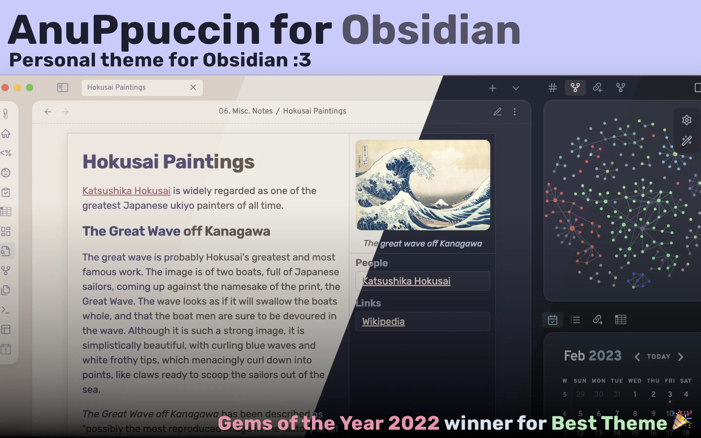

- [Blue Topaz](https://github.com/PKM-er/Blue-Topaz_Obsidian-css) — A blue-accented theme with configurable layouts and visual styles.

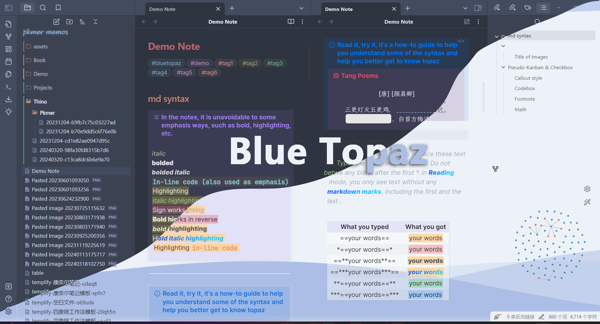

- [Catppuccin](https://github.com/catppuccin/obsidian) — A pastel theme with one light and three dark color palettes.

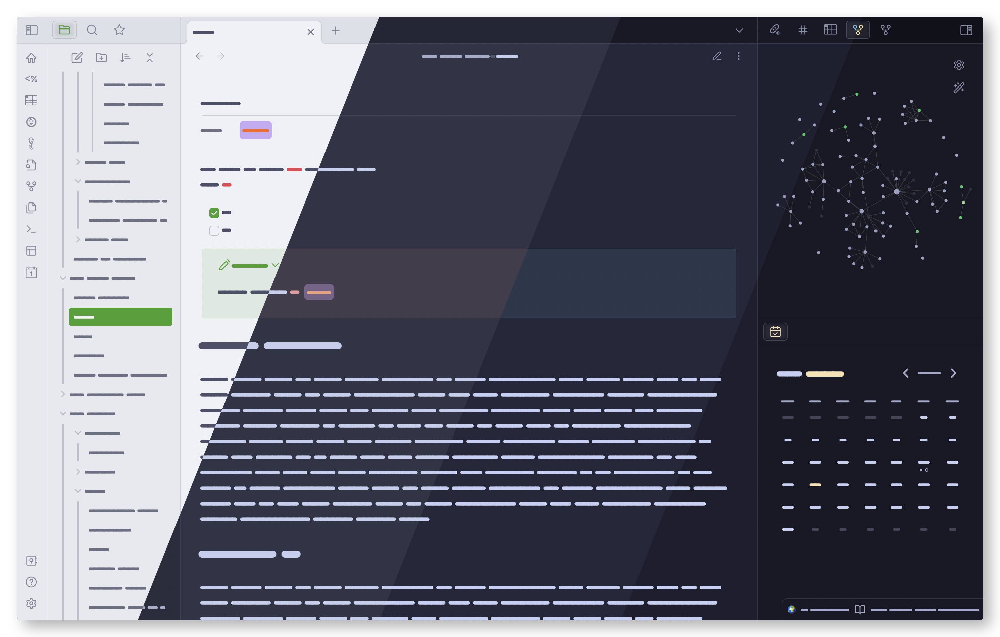

- [Dracula](https://github.com/dracula/obsidian) — A dark theme with the Dracula palette and contrasting syntax colors.

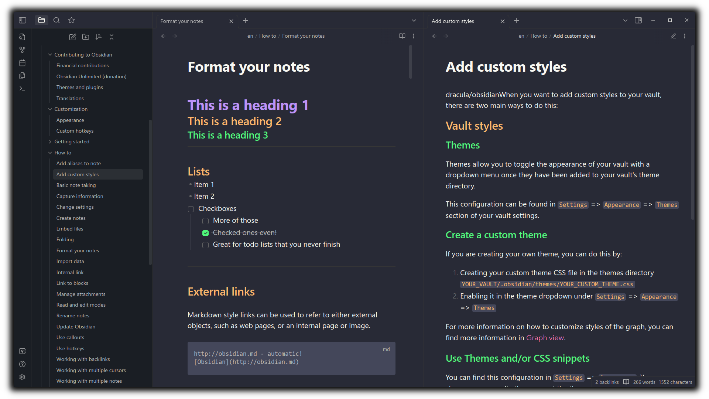

- [ITS Theme](https://github.com/SlRvb/Obsidian--ITS-Theme) — A customizable theme with light and dark modes and detailed reading styles.

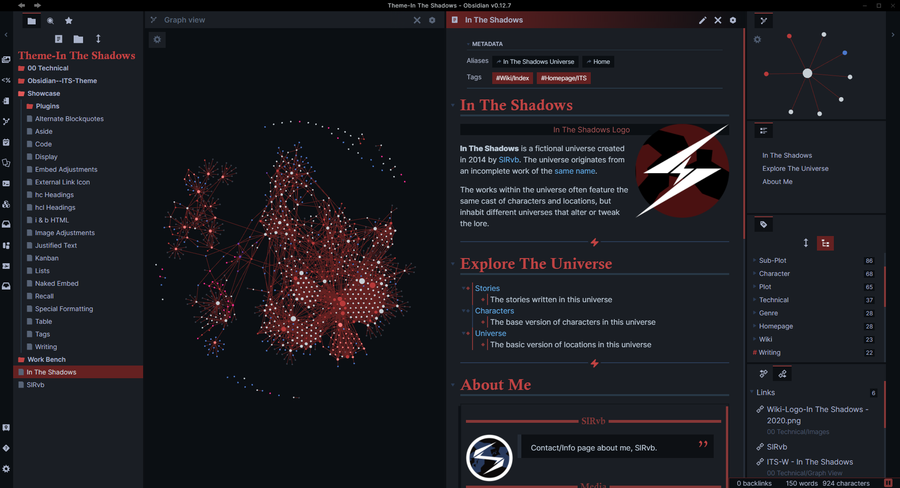

- [Minimal](https://github.com/kepano/obsidian-minimal) — A restrained reading and writing interface with configurable colors, typography and layouts.
  Useful for a quiet interface with room for customization; begin with defaults before adjusting companion settings.

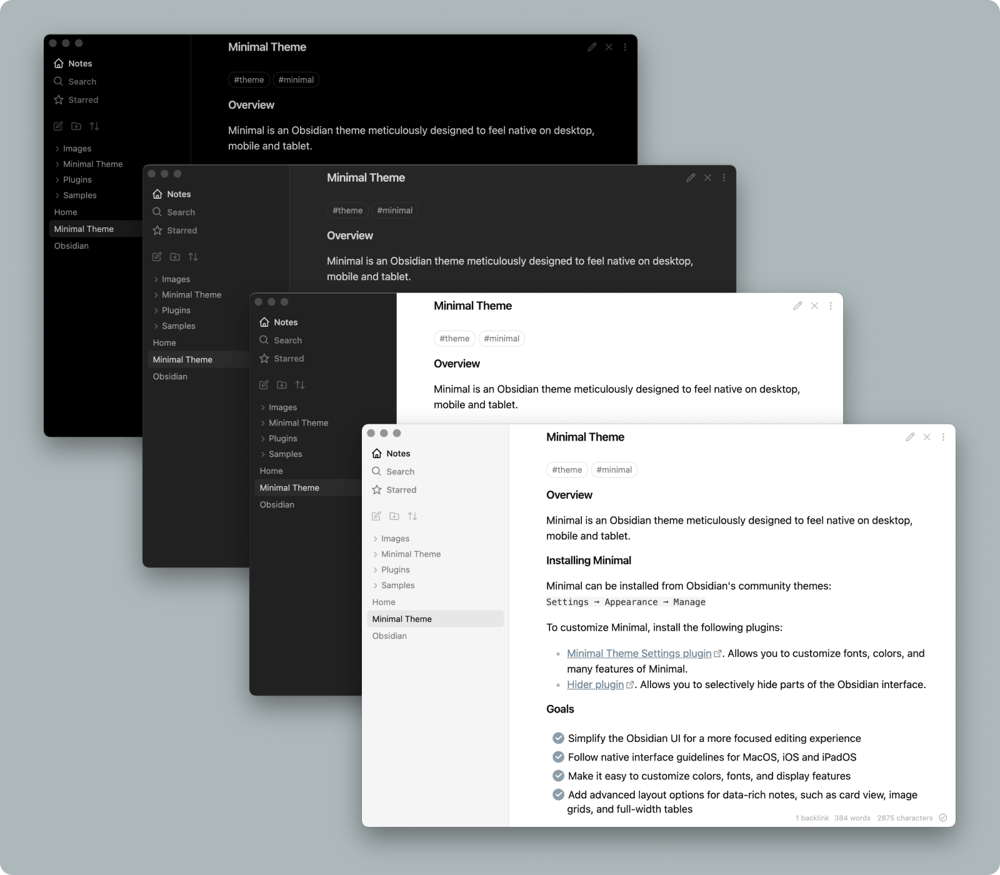

- [Primary](https://github.com/primary-theme/obsidian) — A warm, playful theme with light and dark modes and carefully styled interface details.

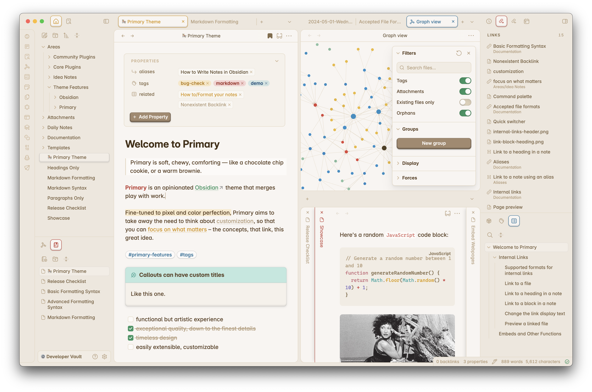

- [Things](https://github.com/colineckert/obsidian-things) — A Things-inspired theme with light and dark modes and custom checkbox styles.

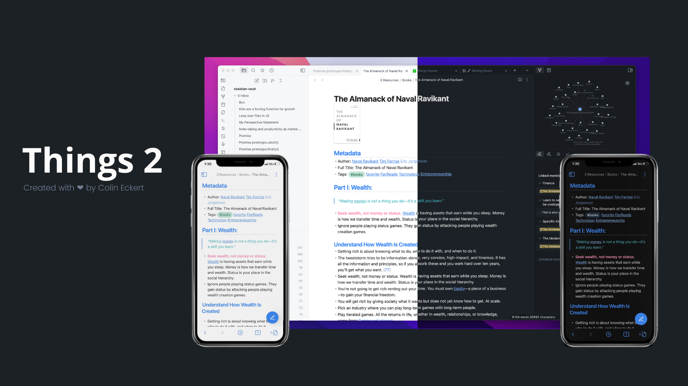

- [Everforest](https://github.com/0xglitchbyte/obsidian_everforest) — Use a forest-inspired palette with muted greens.

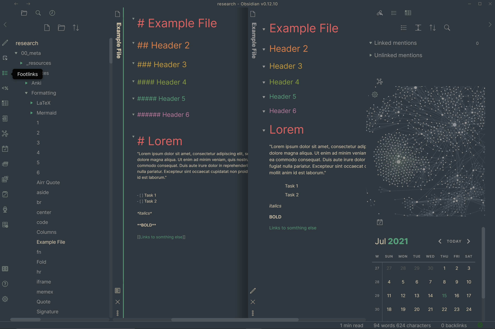

- [Shimmering Focus](https://github.com/chrisgrieser/shimmering-focus) — Reduce interface chrome to focus on reading and writing.

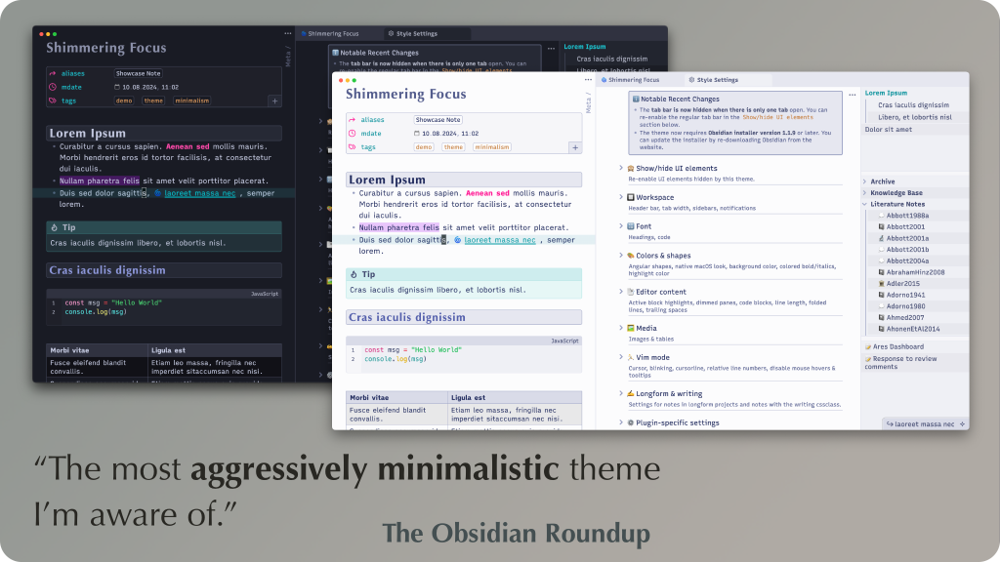

- [Prism](https://github.com/damiankorcz/Prism-Theme) — Customize light and dark layouts with multiple color schemes.

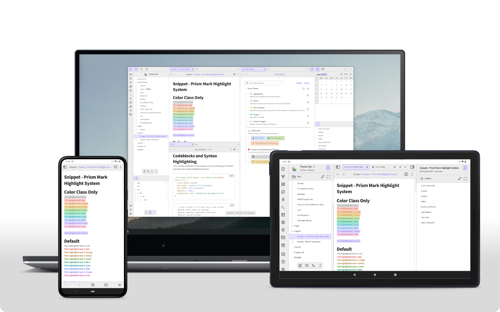

- [Border](https://github.com/akifyss/obsidian-border) — Separate workspace panels with clear boundaries and adjustable styling.

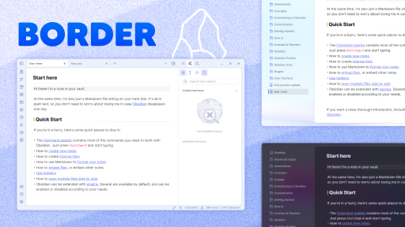

- [Maple](https://github.com/subframe7536/obsidian-theme-maple) — Combine restrained colors with readable note typography.

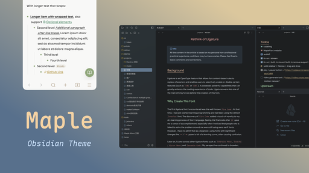

- [Vanilla AMOLED](https://github.com/sakuraisayeki/vanilla-amoled-theme) — Use a black-background variation of the default interface.

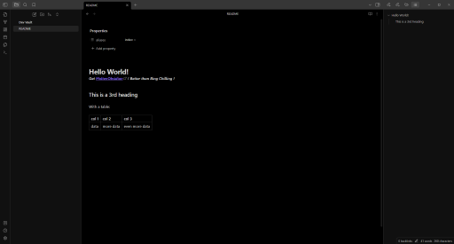

- [Rose Pine](https://github.com/rose-pine/obsidian) — Write with warm, subdued colors inspired by the Rosé Pine palette.

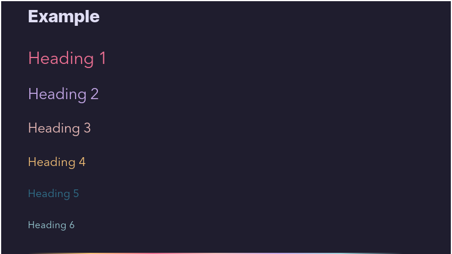

### CSS snippets & layouts

- [Style Settings](https://github.com/community-archive/obsidian-style-settings) — Adjust supported theme, plugin and CSS snippet options from a settings panel.
  Useful for fine-tuning a chosen theme; available controls depend on compatible themes, plugins or snippets.
- [Modular CSS Layout](https://github.com/efemkay/obsidian-modular-css-layout) — Use CSS snippets to add multi-column notes, wide views and gallery cards.
- [Obsidian CSS Snippets](https://github.com/r-u-s-h-i-k-e-s-h/Obsidian-CSS-Snippets) — Pick individual CSS snippets to customize interface elements and note presentation.
- [sailKite's Snippets and Demos](https://github.com/sailKiteV/Obsidian-Snippets-and-Demos) — Adapt CSS snippets and Markdown demonstrations for custom note layouts.
- [Minimal Theme CSS Snippets](https://github.com/replete/obsidian-minimal-theme-css-snippets) — Fine-tune Minimal with targeted interface and typography snippets.
- [Flexoki](https://stephango.com/flexoki) — Explore an ink-and-paper color palette available in themes such as Minimal.

## Templates & vaults

[Personal vault starters](#topic-templates-personal) · [Research & query examples](#topic-templates-examples) · [Note & clipping templates](#topic-templates-notes)

### Personal vault starters

- [kepano’s Obsidian vault](https://github.com/kepano/kepano-obsidian) — A personal vault template with example notes, categories and reusable templates.
  Useful for studying how a real vault is organized; adopt useful structures before moving your own notes.
- [LifeOS](https://github.com/quanru/obsidian-example-lifeos) — Start a personal management vault with PARA folders and periodic-note templates.
- [Bramses’ Highly Opinionated Vault](https://github.com/bramses/bramses-highly-opinionated-vault-2023) — Explore a Zettelkasten-oriented vault with project workflows, templates and tutorials.
- [CyanVoxel’s Vault Template](https://github.com/CyanVoxel/Obsidian-Vault-Template) — Explore a personal vault layout with coordinated CSS snippets and a companion video tour.
- [Dashboard++](https://github.com/TfTHacker/DashboardPlusPlus) — Build a home dashboard with linked sections and multi-column layouts.
- [Zettelkasten Starter Kit](https://github.com/groepl/Obsidian-Zettelkasten-Starter-Kit) — Start a linked-note system with example notes and a ready-made vault structure.
- [JG Method](https://github.com/joshwingreene/obsidian-jg-method) — Explore a starter vault organized around goals, tasks and development work.
- [Ideaverse Lite](https://www.linkingyourthinking.com/ideaverse-for-obsidian/onboarding-ideaverse) — Explore a free linked-note starter vault with maps and example notes.

### Research & query examples

- [Obsidian Starter Templates](https://github.com/masonlr/obsidian-starter-templates) — Explore research-project and technology-radar vaults built around linked notes.
- [Dataview Example Vault](https://github.com/s-blu/obsidian_dataview_example_vault) — Learn Dataview with sample data, basic queries and JavaScript examples in a downloadable vault.
  Useful for modifying queries alongside their results; understand the required fields before copying examples into your vault.
- [Dataview Snippets](https://github.com/Aetherinox/obsidian-dataview-snippets) — Adapt reusable Dataview queries for indexes, lists and galleries.
- [Blue Topaz Example Vault](https://github.com/cumany/Blue-topaz-examples) — Explore a Chinese example vault combining dashboards, plugins and theme layouts.

### Note & clipping templates

- [Obsidian Templates for Zettelkasten](https://github.com/groepl/Obsidian-Templates) — Reuse note templates for books, quotes, concepts and other parts of a Zettelkasten.
  Useful as a consistent starting point; keep fields that support ideas and source links rather than copying every convention.
- [Web Clipper Templates](https://github.com/kepano/clipper-templates) — Capture structured references from sites such as arXiv, Goodreads and Wikipedia.
  Useful for customizing capture fields for frequently read sites; check titles, source URLs and extracted text after importing.
- [Obsidian Dashboard Gallery](https://github.com/InlitX/Obsidian-Dashboard-Gallery) — Reuse dashboard layouts and queries for a visual vault homepage.
- [Meeting decisions and actions](content/en/meeting-note-template.md) — Keep agenda, decisions, owners and next actions in one note for follow-up.
  An original lightweight template from this project. Copy its template sections into your template folder and insert them with core Templates; no community plugin is required.
  [Usage & choosing](content/en/meeting-note-template.md)
- [Reading sources and ideas](content/en/reading-note-template.md) — Separate source claims, your interpretation and open questions while retaining a path to the original.
  An original lightweight template from this project. Copy its template sections into your template folder and insert them with core Templates; no community plugin is required.
  [Usage & choosing](content/en/reading-note-template.md)
- [Project review](content/en/project-review-template.md) — Compare goals with results, reasons and next changes rather than only logging events.
  An original lightweight template from this project. Copy its template sections into your template folder and insert them with core Templates; no community plugin is required.
  [Usage & choosing](content/en/project-review-template.md)

## AI & automation

Model APIs, subscriptions and cloud services may have separate costs.

[Chat & writing](#topic-ai-chat) · [Local models & note retrieval](#topic-ai-retrieval) · [Skills & visual automation](#topic-ai-agents) · [Classification & conversation archives](#topic-ai-organize) · [Audio & learning](#topic-ai-audio-study)

### Chat & writing

- [Copilot](https://github.com/logancyang/obsidian-copilot) — Chat with note context inside Obsidian, or connect agents such as Codex and Claude Code. · Optional payment
  Useful for AI work within the note interface; agent backends run local processes and are desktop features, while mobile has a different feature set.
  Use your own agent account, model key or local model; provider charges are separate, and hosted models or some features require a paid plan.
  [Usage & choosing](content/en/copilot.md)
- [ChatGPT MD](https://github.com/bramses/chatgpt-md) — Keep AI conversations in Markdown notes using cloud providers, Ollama or LM Studio.
- [Text Generator](https://github.com/nhaouari/obsidian-textgenerator-plugin) — Use prompt templates with cloud or local models for repeated note generation and rewriting tasks.
  Useful for tasks with a defined input and output, such as turning points into a draft; compare generated text with the source.
  The plugin is free; cloud models follow provider pricing, and local models require a local runtime.
- [BMO Chatbot](https://github.com/longy2k/obsidian-bmo-chatbot) — Chat with configurable AI personas using local or cloud model providers.
- [Companion](https://github.com/rizerphe/obsidian-companion) — Suggest inline text completions using the surrounding note as context.
- [Tars](https://github.com/tarslab/obsidian-tars) — Generate text through tag-triggered prompts with multiple model providers.
- [Smart Composer](https://github.com/glowingjade/obsidian-smart-composer) — Ask questions with note context and apply suggested edits to the vault.
- [Copilot auto completion](https://github.com/j0rd1smit/obsidian-copilot-auto-completion) — Show configurable AI text completions beside the cursor as you write.

### Local models & note retrieval

- [Local GPT](https://github.com/pfrankov/obsidian-local-gpt) — Summarize or rewrite selected text using configurable AI actions and local model support.
  Useful for focused actions on selected text; whether processing is local depends on the configured model endpoint.
- [Smart Connections](https://github.com/brianpetro/obsidian-smart-connections) — Surface semantically related notes and excerpts with local embeddings. · Optional payment
- [LLM Workspace](https://github.com/ofalvai/obsidian-llm-workspace) — Chat with a manually selected set of notes and inspect the sources used for retrieval.
- [Ollama Chat](https://github.com/brumik/obsidian-ollama-chat) — Ask questions about your notes using Ollama and a local retrieval setup.

### Skills & visual automation

- [Obsidian Skills](https://github.com/kepano/obsidian-skills) — Provide compatible AI agents with instructions for Obsidian formats and CLI tasks, including Markdown, Bases and Canvas.
  This is a skill collection rather than a standalone Obsidian plugin; choose skills for the task and configure an agent.
  Skill files are free; the selected agent or model service may charge separately.
  [Usage & choosing](content/en/obsidian-skills.md)
- [Cannoli](https://github.com/DeabLabs/cannoli) — Build executable AI workflows with cards and arrows in Obsidian Canvas.
- [Loom](https://github.com/cosmicoptima/loom) — Explore alternative continuations of a text through branching AI generations.
- [Chat Stream](https://github.com/rpggio/obsidian-chat-stream) — Branch AI conversations on Canvas while choosing which ancestor notes provide context.
- [Smart Templates](https://github.com/brianpetro/obsidian-smart-templates) — Combine Markdown templates and selected vault context into repeatable AI prompts. · Optional payment
- [AI for Templater](https://github.com/tfthacker/obsidian-ai-templater) — Call OpenAI-compatible language models from Templater scripts.
- [Obsidian Markdown Skill](https://github.com/kepano/obsidian-skills/blob/main/skills/obsidian-markdown/SKILL.md) — Create and edit notes with wikilinks, embeds, callouts and properties.
  Useful when an agent edits note syntax; it is not a control interface for the running app.
  Skill files are free; agent or model usage may have separate charges.
- [Obsidian Bases Skill](https://github.com/kepano/obsidian-skills/blob/main/skills/obsidian-bases/SKILL.md) — Guide an agent in creating and editing Bases views, filters and formulas.
  Useful for generating views over structured notes; standardize properties before checking filter results.
  Skill files are free; agent or model usage may have separate charges.
- [JSON Canvas Skill](https://github.com/kepano/obsidian-skills/blob/main/skills/json-canvas/SKILL.md) — Guide an agent in building Canvas files with nodes, edges and groups.
  Useful for turning known relationships into a canvas; inspect layout and connection meaning after generation.
  Skill files are free; agent or model usage may have separate charges.
- [Obsidian CLI Skill](https://github.com/kepano/obsidian-skills/blob/main/skills/obsidian-cli/SKILL.md) — Guide an agent in interacting with a vault through the CLI and checking available commands.
  Useful for app operations beyond file editing; requires Obsidian running with its CLI enabled.
  Skill files are free; agent or model usage may have separate charges.

### Classification & conversation archives

- [Auto Classifier](https://github.com/HyeonseoNam/auto-classifier) — Suggest note tags using OpenAI-compatible models or Jina AI classification.
- [Nexus AI Chat Importer](https://github.com/Superkikim/nexus-ai-chat-importer) — Import ChatGPT, Claude and other exported AI conversations as local Markdown notes.
- [AI Tagger](https://github.com/lucagrippa/obsidian-ai-tagger) — Suggest tags from your existing vocabulary using a language model.
- [AI Summarize](https://github.com/ravenwits/obsidian-ai-summarize) — Create note summaries and folder digests with an OpenAI model.
- [packUp4AI](https://github.com/shuxueshuxue/PackUp4AI) — Bundle linked notes and backlinks into focused context for external AI tools.

### Audio & learning

- [Aloud](https://github.com/adrianlyjak/obsidian-aloud-tts) — Read notes aloud and export audio through a configured speech-generation service.
- [Quiz Generator](https://github.com/ECuiDev/obsidian-quiz-generator) — Turn selected notes into interactive practice questions with an AI model.
- [Whisper](https://github.com/nikdanilov/whisper-obsidian-plugin) — Transcribe recorded or uploaded audio through a Whisper-compatible API.
- [AI LaTeX Generator](https://github.com/aaaaayushh/ai-latex-generator) — Convert a selected natural-language formula description into LaTeX using Ollama.
- [Voicenotes Sync](https://github.com/voicenotes-community/voicenotes-sync) — Import recordings, transcripts and generated summaries from a Voicenotes account. · Optional payment

## Tools & integrations

[Reading & migration](#topic-integrations-collect) · [Publishing & digital gardens](#topic-integrations-publish) · [App launchers, APIs & MCP](#topic-integrations-connect) · [Export & conversion](#topic-integrations-export) · [Sync & storage](#topic-integrations-sync)

### Reading & migration

- [Importer](https://github.com/obsidianmd/obsidian-importer) — Convert notes from apps such as Notion, Evernote and OneNote into Markdown.
- [Obsidian Web Clipper](https://obsidian.md/clipper) — Save web pages and highlights to Obsidian, with optional AI processing.
  Useful for capturing pages before making reading notes; add your own summary and purpose so the vault is more than copied pages.
- [Readwise Reader](https://readwise.io/read) — Read articles and PDFs, then export highlights to Obsidian through Readwise. · Paid
- [YARLE](https://github.com/akosbalasko/yarle) — Convert Evernote exports to Markdown while preserving attachments, metadata and note links.
- [ReadItLater](https://github.com/dominikpieper/obsidian-ReadItLater) — Save web content as notes using templates tailored to different source types.
- [Weread](https://github.com/zhaohongxuan/obsidian-weread-plugin) — Sync highlights and annotations from WeRead into reading notes.
- [MarkDownload](https://github.com/deathau/markdownload) — Save browser pages as Markdown files for your vault.
- [Keep It Markdown](https://github.com/djsudduth/keep-it-markdown) — Export Google Keep notes into Markdown for migration and archiving.

### Publishing & digital gardens

- [Quartz](https://github.com/jackyzha0/quartz) — Turn Markdown notes into a website with backlinks, search and a graph view.
  Useful when you want control over publishing and site styling; expect to configure builds and hosting.
- [Digital Garden](https://github.com/oleeskild/obsidian-digital-garden) — Publish selected Obsidian notes to a digital garden using a configurable site template.
- [Perlite](https://github.com/secure-77/Perlite) — Browse a Markdown vault through a self-hosted web interface.
- [Flowershow](https://github.com/flowershow/flowershow) — Publish Markdown as a website with hosted plans and an open-source codebase. · Optional payment

### App launchers, APIs & MCP

- [Advanced URI](https://github.com/Vinzent03/obsidian-advanced-uri) — Trigger Obsidian actions from links in shortcuts and other applications.
- [Local REST API](https://github.com/coddingtonbear/obsidian-local-rest-api) — Connect scripts and agents to your vault through a local REST API and MCP server.
- [Shell commands](https://github.com/Taitava/obsidian-shellcommands) — Run configured terminal commands with note variables and insert their output into notes.
- [Shimmering Obsidian](https://github.com/chrisgrieser/shimmering-obsidian) — Search and create Obsidian notes from Alfred on macOS; requires Alfred Powerpack. · Paid

### Export & conversion

- [Kindle](https://github.com/simeonlukas/obsidian-kindle-export) — Export notes and embedded content as EPUB through a configured conversion backend.
- [Pandoc Plugin](https://github.com/oliverbalfour/obsidian-pandoc) — Export notes to DOCX, EPUB and other formats through an installed Pandoc converter.

### Sync & storage

- [Obsidian Git](https://github.com/Vinzent03/obsidian-git) — Inspect changes, commit versions and sync with a remote Git repository from your vault.
  Best suited to desktop users familiar with Git; substantial mobile limitations make it a poor default for cross-device sync.
  [Usage & choosing](content/en/obsidian-git.md)
- [Self-hosted LiveSync](https://github.com/vrtmrz/obsidian-livesync) — Sync vaults through a self-hosted CouchDB or supported object-storage backend.
- [Remotely Save](https://github.com/remotely-save/remotely-save) — Sync notes with supported cloud storage, with optional paid sync features. · Optional payment
- [S3 attachments storage](https://github.com/ttax00/obsidian-s3) — Store and retrieve media attachments through S3-compatible object storage.

## Workflows

- [From a saved article to a usable note](content/en/reading-workflow.md) — Turn a saved article into a linked note you can find and reuse.
- [From a question to a sourced answer](content/en/research-workflow.md) — Compare sources and connect each conclusion to its evidence.
- [From linked notes to a finished draft](content/en/writing-workflow.md) — Turn source notes into an outline, draft and exportable article.
- [From course notes to usable knowledge](content/en/learning-workflow.md) — Practice recall, record mistakes and apply concepts in a small task.
- [From a project goal to next actions](content/en/projects-workflow.md) — Connect outcomes, tasks and weekly reviews in a project note.
- [Use AI with a focused set of notes](content/en/ai-workflow.md) — Ask source-based questions and review proposed note changes before applying them.
- [From device sync to recoverable backups](content/en/sync-backup-workflow.md) — Choose a sync method, keep independent backups and verify them with a restore exercise.
  Use when adding devices, migrating a vault or changing sync methods.

## Methods

[Organizing & connecting ideas](#topic-methods-principles) · [Note design & publishing](#topic-methods-design)

### Organizing & connecting ideas

- [Zettelkasten: getting started](https://zettelkasten.de/overview/) — Learn how to connect notes into a Zettelkasten for reading and writing.
- [Evergreen notes](https://notes.andymatuschak.org/Evergreen_notes) — Learn to develop connected, concept-focused notes through repeated revision.
- [The PARA Method](https://fortelabs.com/blog/para/) — Organize notes into Projects, Areas, Resources and Archives around actionable work.
- [File over app](https://stephango.com/file-over-app) — Understand why durable, controllable files matter when choosing a note-taking system.
- [Johnny.Decimal](https://johnnydecimal.com/documentation/introduction) — Use numbered areas and categories to give files and notes predictable locations.

### Note design & publishing

- [Evergreen Notes — Steph Ango](https://stephango.com/evergreen-notes) — Write reusable ideas as notes that can develop and connect over time.
- [A Brief History & Ethos of the Digital Garden](https://maggieappleton.com/garden-history) — Understand digital gardens as evolving, connected collections of public notes.
- [Progressive Summarization](https://fortelabs.com/blog/progressive-summarization-a-practical-technique-for-designing-discoverable-notes/) — Layer highlights and summaries to make useful passages easier to rediscover.
- [Evergreen Notes Should Be Atomic](https://notes.andymatuschak.org/Evergreen_notes_should_be_atomic) — Keep a note focused on one idea so it can be reused in different contexts.
- [Evergreen Notes Should Be Concept-Oriented](https://notes.andymatuschak.org/Evergreen_notes_should_be_concept-oriented) — Organize reusable notes around concepts rather than the source that introduced them.

## Learning & community

[Communities & directories](#topic-learning-community) · [Courses & author resources](#topic-learning-learn) · [Articles & practical tutorials](#topic-learning-tutorials)

### Communities & directories

- [Obsidian Forum](https://forum.obsidian.md/) — Find answers, share workflows and discuss plugins with the Obsidian community.
- [Obsidian Chinese Forum](https://forum-zh.obsidian.md/) — Discuss plugins, note-taking methods and troubleshooting in Chinese.
- [Obsidian Hub](https://github.com/obsidian-community/obsidian-hub) — Browse community knowledge online or download the shared vault to explore it in Obsidian.
- [PKMer](https://pkmer.cn/) — Find Chinese Obsidian tutorials, plugin guides and knowledge-management resources. · Optional payment

### Courses & author resources

- [Linking Your Thinking](https://www.linkingyourthinking.com/) — Explore Nick Milo’s linked-note workflows, learning resources and workshops. · Optional payment
- [Obsidian Blog](https://obsidian.md/blog/) — Follow official feature announcements, product updates and community highlights.
- [Building a Second Brain](https://www.buildingasecondbrain.com/) — Explore books, resources and courses about organizing knowledge for creative work. · Optional payment

### Articles & practical tutorials

- [How I use Obsidian](https://stephango.com/vault) — See how Steph Ango uses categories, properties, templates and links in a personal vault.
  Useful for examining the author’s organizational choices; compare your own inputs and outputs instead of copying the entire workflow.
- [Obsidian Rocks](https://obsidian.rocks/) — Read practical tutorials on Obsidian features, plugins and everyday workflows.
- [Back up your Obsidian files](https://help.obsidian.md/backup) — Explains the difference between sync and backup and how to keep recoverable vault copies.
  Read before adding devices or migrating; the goal is restoring an earlier state, not merely seeing the same files elsewhere.
- [Sync your notes across devices](https://help.obsidian.md/sync-notes) — Compare official sync, cloud drives and other methods with their device-specific setup differences.
  Filter by your device combination before following setup steps; desktop support does not imply equivalent mobile support.
- [Community plugin security](https://help.obsidian.md/Extending+Obsidian/Plugin+security) — Understand community plugin capabilities and the role of Restricted Mode.
  Read before installing plugins or connecting AI to a vault; directory inclusion does not provide fine-grained permission isolation.

## Development

[Build plugins & tools](#topic-development-build) · [Development & testing tools](#topic-development-testing)

### Build plugins & tools

- [Obsidian Developer Docs](https://docs.obsidian.md/) — Read official guides for building plugins and themes and working with the API.
- [Obsidian Sample Plugin](https://github.com/obsidianmd/obsidian-sample-plugin) — The official starter template for building Obsidian community plugins.
- [Obsidian API](https://github.com/obsidianmd/obsidian-api) — Use the official TypeScript definitions when developing Obsidian plugins.
- [JSON Canvas](https://jsoncanvas.org/) — Use the open canvas format to exchange nodes, edges and groups between tools.
- [Obsidian Sample Theme](https://github.com/obsidianmd/obsidian-sample-theme) — Use the official starter files to create and submit an Obsidian theme.
- [Obsidian Releases](https://github.com/obsidianmd/obsidian-releases) — Find the official registries used to distribute community plugins and themes.
- [Obsidian Translations](https://github.com/obsidianmd/obsidian-translations) — Contribute translations for Obsidian's interface.
- [Obsidian Typings](https://github.com/obsidian-typings/obsidian-typings) — Explore community TypeScript definitions that extend the official API types.

### Development & testing tools

- [Execute Code](https://github.com/twibiral/obsidian-execute-code) — Run supported code blocks locally and display their output beneath the code.
- [BRAT](https://github.com/tfthacker/obsidian42-brat) — Install and update beta plugins or themes directly from their repositories.
- [Hot Reload](https://github.com/pjeby/hot-reload) — Reload plugins under development when their files change.
- [Plugin Reloader](https://github.com/benature/obsidian-plugin-reloader) — Reload a selected plugin from a command or hotkey during development.
- [Obsidian ESLint Plugin](https://github.com/obsidianmd/eslint-plugin) — Check plugin code against Obsidian-specific API and development rules.
<!-- catalog:end -->

[Image credits](assets/README.md)

## Acknowledgements

Thanks to these community lists for resource leads and ideas for organizing the catalog:

- [kmaasrud/awesome-obsidian](https://github.com/kmaasrud/awesome-obsidian)
- [obsidian-pkm-vault/awesome-obsidian-vault](https://github.com/obsidian-pkm-vault/awesome-obsidian-vault)
- [PKM-er/awesome-obsidian-zh](https://github.com/PKM-er/awesome-obsidian-zh)
- [awesome-obsidian/awesome-obsidian](https://github.com/awesome-obsidian/awesome-obsidian)
- [danielrosehill/Awesome-Obsidian-AI-Tools](https://github.com/danielrosehill/Awesome-Obsidian-AI-Tools)
